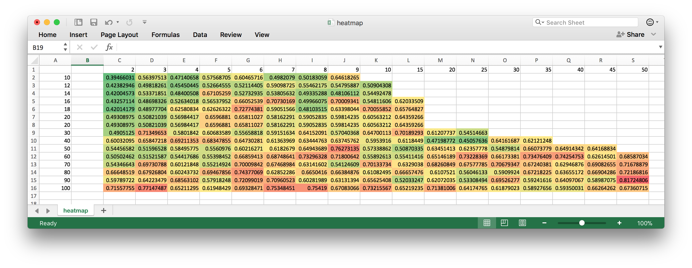

# Surfingcat Trading Bot in Golang for Cryptocurrencies
Welcome to the crypto trading bot repository.

Currently supported

exchanges:
- Bittrex

strategies:
- Golden cross
- Buy dip & sell spike

GUI:
- Backtesting
- Balance

You are welcomed to fork or/and contribute.

## Running Docker
1. Create new docker machine `docker-machine create -d virtualbox --virtualbox-hostonly-cidr 192.168.10.1/24 --virtualbox-memory '1024' --virtualbox-boot2docker-url https://releases.rancher.com/os/latest/rancheros.iso --engine-install-url https://raw.githubusercontent.com/SvenDowideit/install-docker/5896b863698967df0738976d6ee98efc5d4637ae/1.12.6.sh spa-sandbox`
2. `docker build -t surfingcat-trading-bot .`
3. `docker run -p 3026:3026 -d --name surfingcat-trading-bot surfingcat-trading-bot`
4. `curl "http://192.168.33.100:3026/indicator?name=ema&market=USDT-BTC&interval=50"`

## Running locally

- Running server locally 
    - `cd server`
    - ``BITTREX_PUBLIC_KEY=<pbk> BITTREX_PRIVATE_KEY=<pvk> go run `ls *.go | grep -v _test.go` ``
- Running frontend 
    - `npm run dev`

## Testing API

- Testbed chart `http://localhost:3026/chart/testbed`
- Running an indicator on a testbed `http://localhost:3026/indicator/testbed?name=trima&market=USDT-BTC&interval=30`
- Test a strategy on a testbed data `http://localhost:3026/strategy/test?market=USDT-BTC&strategy=dip`

### Find the best peroforming strategy params 

- Execute `curl "http://localhost:3026/strategy/supertest?market=btcfct1&strategy=dip"`
- Find the best performing setup in server logs output.
- Copy `CSV` output into docs/heatmap.csv replacing the contents starting from the second line (to preserve the header).
- Open the file in Excel and apply Color Scale format.

